# Lab1 Report

> Report on the 2019 HCI Lab1 in the School of Software, Tongji University
>
> Automatic Speech Recognition
>
> Student Number：1653340
>
> Name：王亮

---

[TOC]


## 1. Introduction

This project is a voice assistant software running in the Mac system, based on Speech Recognition System and CMU Sphinx Speech Recognition Engine, using Qt to realize the graphical user interface.

The program can receive user’s voice command, recognize
the content and finish the task, just like Siri and Cortana.

In particular, the development environment of this project is the **macOS** operating system. Because of the incompatibility of the operating system, this project can **NOT** run under the **Windows** operating system.

## 2. Architecture

### 2.1 System Level

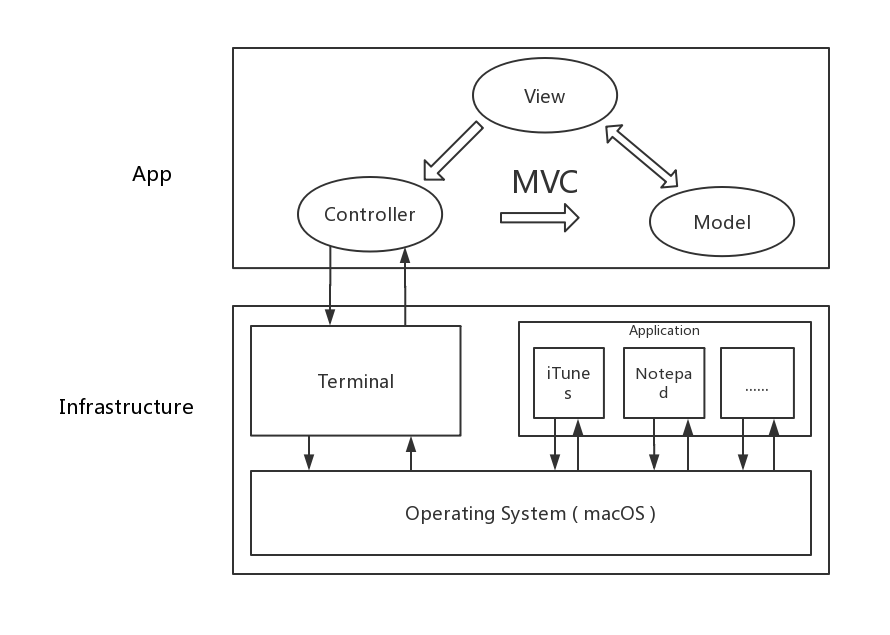

MVC model is adopted in the program architecture.

View is a graphical user interface implemented by Qt.

Controller includes the business logic of the program, which receives and recognizes the user's voice commands, and then completes the task.

Model refers to the user's commands in this program.

### 2.2 Speech Recognition

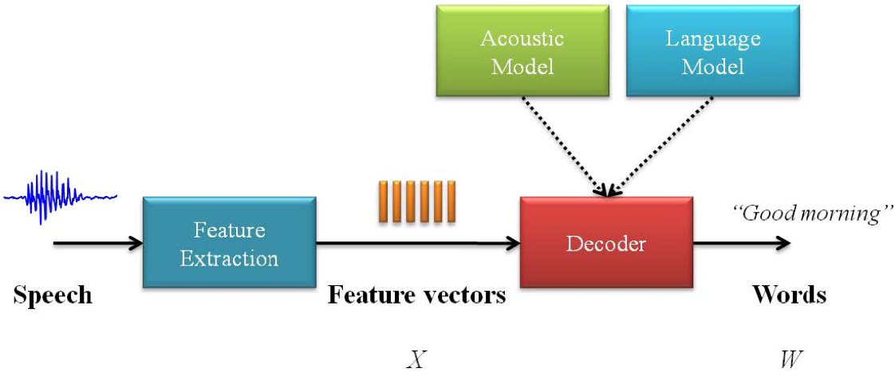

The project imports Speech Recognition module and uses CMU Sphinx as speech recognition engine.

The module extracts features from speech, obtains feature vectors, and converts them into words through recognition model.

## 3. GUI

This project uses Qt to realize graphical user interface. The program runs in a multi-threaded way. The graphical user interface is maintained by the main thread, and the voice interaction tasks are handled by the sub-threads.

On the basis of the original interface of the project, add two new text labels and set their color. One is used to display the text results of speech recognition, the other is used to guide the user how to do or send notifications to the user.

### 3.1 Code

Only show the modified parts.

```python
# asrInterface.py
from PyQt5 import QtCore, QtGui, QtWidgets
from PyQt5.QtGui import QMovie

class Ui_MainWindow(object):
    def setupUi(self, MainWindow):
		# =============
        # Other code...
        # =============
        
        self.label_5 = QtWidgets.QLabel(self.centralwidget)
        self.label_5.setGeometry(QtCore.QRect(60, 380, 201, 51))
        font = QtGui.QFont()
        font.setFamily("Calibri")
        font.setPointSize(14)
        self.label_5.setFont(font)
        self.label_5.setStyleSheet("color: rgb(0, 238, 238);")
        self.label_5.setWordWrap(True)
        self.label_5.setObjectName("label_5")

        self.label_6 = QtWidgets.QLabel(self.centralwidget)
        self.label_6.setGeometry(QtCore.QRect(60, 420, 201, 51))
        font = QtGui.QFont()
        font.setFamily("Calibri")
        font.setPointSize(14)
        self.label_6.setFont(font)
        self.label_6.setStyleSheet("color: rgb(0, 238, 238);")
        self.label_6.setWordWrap(True)
        self.label_6.setObjectName("label_6")

        # =============
        # Other code...
        # =============
        
# =============
# Other code...
# =============
    def updateL5(self, text):
        _translate = QtCore.QCoreApplication.translate
        self.label_5.setText(_translate("MainWindow", text))

    def updateL6(self, text):
        _translate = QtCore.QCoreApplication.translate
        self.label_6.setText(_translate("MainWindow", text))


```


### 3.2 Appearance

#### 3.2.1 launch

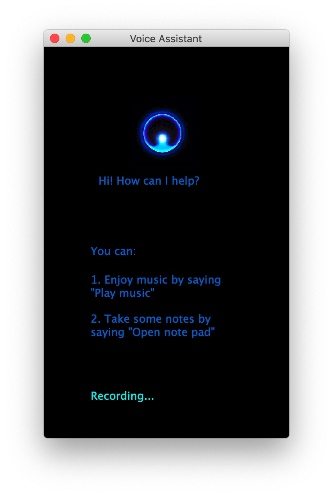

#### 3.2.2 Complete the Task

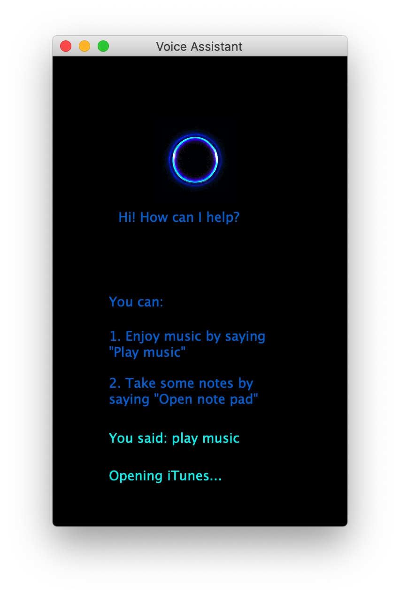

#### 3.2.3 Unable to Complete the Task

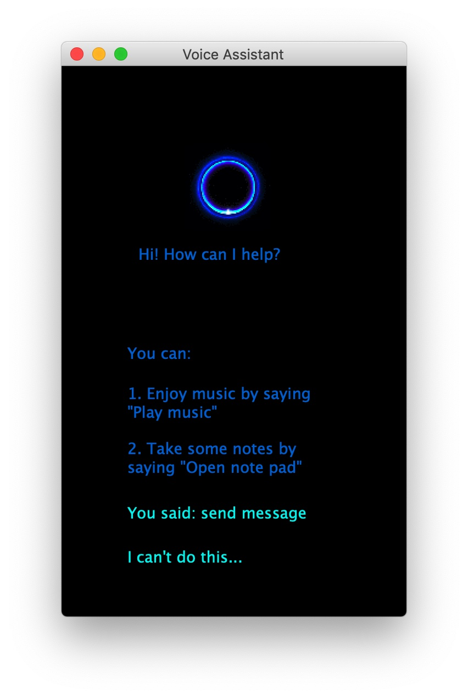

## 4. Function and Code Implementation

### 4.1 Record Speech and Speech Recognition

This part includes two functions, `recognize_speech_from_mic(recognizer, microphone)` is to recognize microphone recording and`speech_interaction(mywindow)` is to interact with users.

#### 4.1.1 Code

```python
def recognize_speech_from_mic(recognizer, microphone):
    """Transcribe speech from recorded from `microphone`.

    Returns a dictionary with three keys:
    "success": a boolean indicating whether or not the API request was
               successful
    "error":   `None` if no error occured, otherwise a string containing
               an error message if the API could not be reached or
               speech was unrecognizable
    "transcription": `None` if speech could not be transcribed,
               otherwise a string containing the transcribed text
    """
    # check that recognizer and microphone arguments are appropriate type
    if not isinstance(recognizer, sr.Recognizer):
        raise TypeError("`recognizer` must be `Recognizer` instance")

    if not isinstance(microphone, sr.Microphone):
        raise TypeError("`microphone` must be `Microphone` instance")

    # adjust the recognizer sensitivity to ambient noise and record audio
    # from the microphone
    with microphone as source:
        recognizer.adjust_for_ambient_noise(source)
        audio = recognizer.listen(source)

    # set up the response object
    response = {
        "success": True,
        "error": None,
        "transcription": None
    }

    # try recognizing the speech in the recording
    # if a RequestError or UnknownValueError exception is caught,
    #     update the response object accordingly
    try:
        response["transcription"] = recognizer.recognize_sphinx(audio)
    except sr.RequestError:
        # API was unreachable or unresponsive
        response["success"] = False
        response["error"] = "API unavailable"
    except sr.UnknownValueError:
        # speech was unintelligible
        response["error"] = "Unable to recognize speech"

    return response


def speech_interaction(mywindow):

    # 语音播报（文本转语音）
    engine = pyttsx3.init()
    engine.say("请问您需要什么帮助？")
    engine.runAndWait()

    # obtain audio from the microphone
    # 从麦克风记录数据
    r = sr.Recognizer()
    with sr.Microphone() as source:
        guess = recognize_speech_from_mic(r, sr.Microphone())
        print("You said: {}".format(guess["transcription"]))
        mywindow.ui.updateL5("You said: {}".format(guess["transcription"]))

    # 语音播报（文本转语音）
    engine.say("录音结束, 识别中")
    engine.runAndWait()

    # 根据识别结果，完成对应的工作
    c = Controller()
    if (guess["transcription"] == "play music"):
        c.playMusic("The Human Touch.mp3")
        mywindow.ui.updateL6("Opening iTunes...")
    elif(guess["transcription"] == "open note pad"):
        c.openNotepad()
        mywindow.ui.updateL6("Opening Typora...")
    else:
        mywindow.ui.updateL6("I can't do this...")
```

### 4.2 Voice Announcements

Pyttsx3 module is used to transfer text to voice and realize voice broadcasting function. The program can issue voice based on user prompts and interact with users.

*Because Pyttsx3 module can not work properly in multi-threaded environment, so the relevant code is annotated temporarily, and the voice broadcast function is **not open**.*

#### 4.2.1 Code

```python
import pyttsx3

# =============
# Other code...
# =============

engine = pyttsx3.init()
engine.say("请问您需要什么帮助？")
engine.runAndWait()

# =============
# Other code...
# =============

engine.say("录音结束, 识别中")
engine.runAndWait()

```

### 4.3 Play Music

Launch iTunes and play the audio file ` The Human Touch.mp3`

#### 4.3.1 Code

```python
import os

class Controller:
    def __init__(self):
        self.status = 0
        self.command = ''

    # 启动 iTunes 播放音乐
    def playMusic(self, fileName):
        fileName = self.normalize(fileName)
        self.command = "open -a /Applications/iTunes.app " + fileName
        os.system(self.command)

    # 把文件名转化成 Terminal 可以执行的格式（字符串处理）
    def normalize(self, fileName):
        beginPosition = fileName.find(" ", 0)
        while (beginPosition != -1):
            list_fileName = list(fileName)
            list_fileName.insert(beginPosition, '\\')
            fileName = "".join(list_fileName)
            beginPosition = fileName.find(" ", beginPosition+2)
        return fileName
```

#### 4.3.2 Screenshot


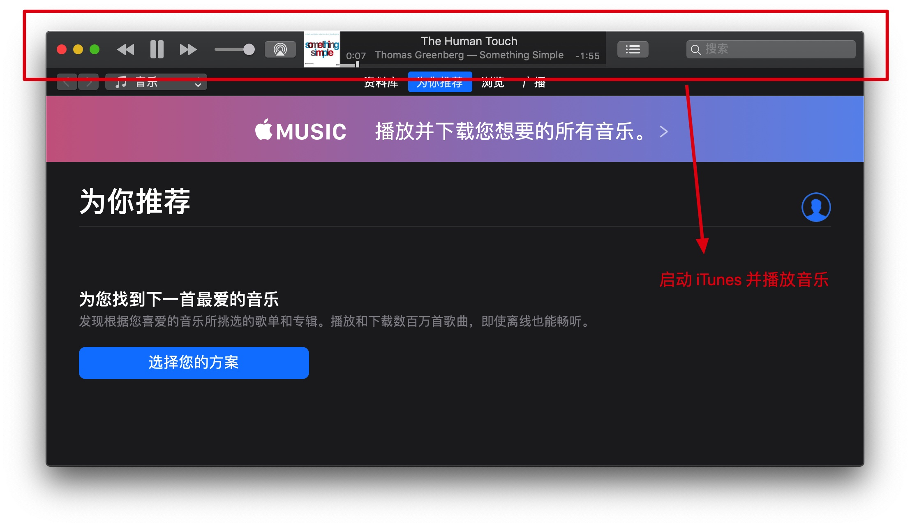

### 4.4 Open Notepad

Launch Typora then user can take notes.

> Typora is a markdown editor that users can use to take notes.

#### 4.4.1 Code

```python
    def openNotepad(self):
        self.command = "open -a /Applications/Typora.app"
        os.system(self.command)
```

```python
    if (guess["transcription"] == "play music"):
        # ...
    elif(guess["transcription"] == "open note pad"):
        c.openNotepad()
        mywindow.ui.updateL6("Opening Typora...")
    else:
        # ...
```

#### 4.4.2 Screenshot

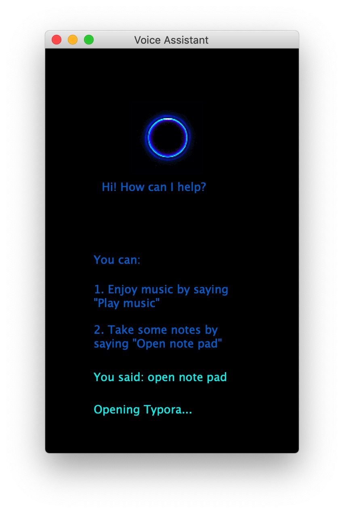

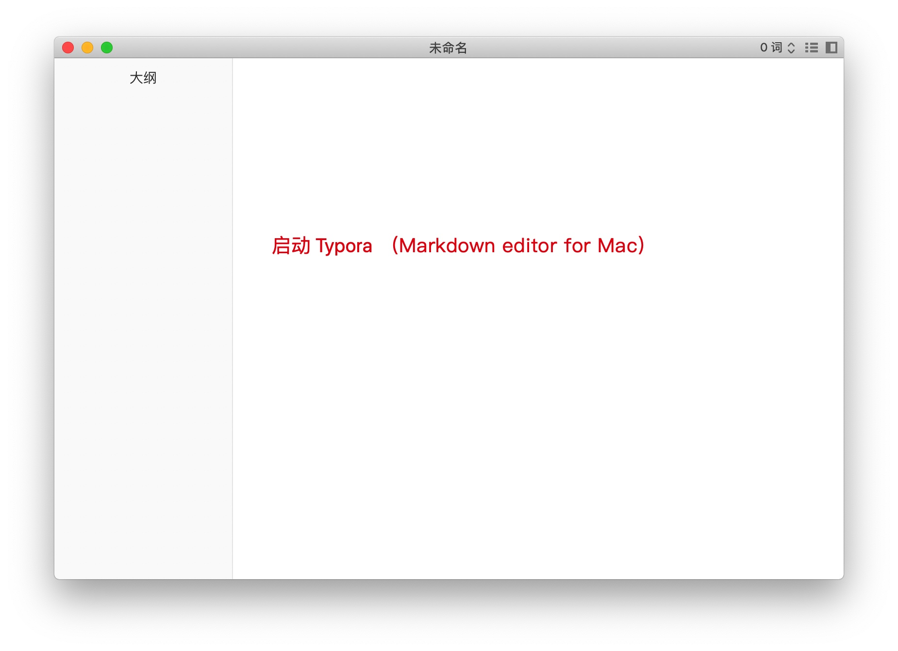


### 4.5 Play Video

Launch IINA and play the video file ` Lillard.mp4`

#### 4.5.1 Code

```python
    def playVideo(self, fileName):
        fileName = self.normalize(fileName)
        self.command = "open -a /Applications/IINA.app " + fileName
        os.system(self.command)
```

#### 4.5.2 Screenshot

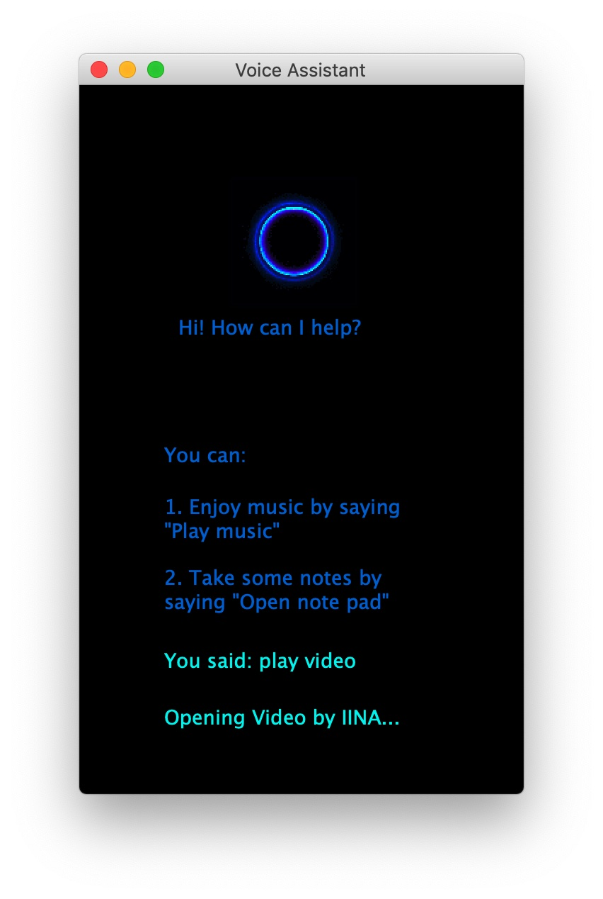

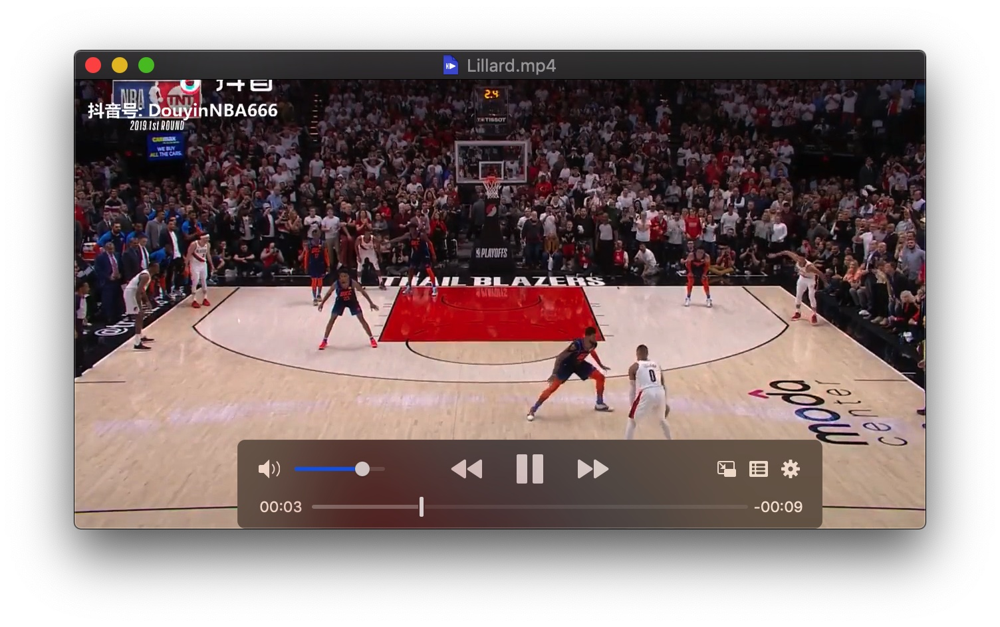

### 4.6 Shutdown

#### 4.6.1 Code

```python
if(guess["transcription"] == "shutdown"):
	c.shutdown()
	mywindow.ui.updateL6("Shutdown...")
```

```python
def shutdown(self):
	self.command = "sudo halt"
	os.system(self.command)
```

### 4.7 Multithreading

The main thread is responsible for displaying the graphical user interface, and the sub-thread deals with voice interaction.

#### 4.7.1 Code

```python
# 继承QThread
class Runthread(QtCore.QThread):
    # python3,pyqt5与之前的版本有些不一样
    #  通过类成员对象定义信号对象
    _signal = pyqtSignal(str)

    def __init__(self, mywindow):
        super(Runthread, self).__init__()
        self.mw = mywindow

    def __del__(self):
        self.wait()

    def run(self):
        speech_interaction(self.mw)
        # self._signal.emit("run")  # 信号发送
```

```python
app = QtWidgets.QApplication([])
application = myWindow()
application.show()

thread = Runthread(application)
thread.start()

sys.exit(app.exec())
```


## 5. Analysis

### 5.1 Recognition Accuracy Analysis

The project uses CMU Sphinx as the speech recognition engine, so the recognition accuracy **depends on the performance of the engine**.

From the actual performance, the recognition engine only supports English language, and the accuracy of speech recognition is not high.

Especially when people give instructions to it, it seldom recognize it accurately. The recognition accuracy is relatively high when commands are issued by reading software such as Google Translate. This indicates that the poor pronunciation is one of the reasons for the low recognition accuracy.

Nevertheless, compared with Siri and other excellent voice assistants, the speech recognition accuracy of this program is still low.

If we want to improve the recognition accuracy, I think we can consider the following methods:

1. Change to a better speech recognition model.
2. Preprocess audio before speech recognition, such as noise reduction.

> CMU Sphinx (Sphinx) is the general name of a series of speech recognition systems developed by Carnegie Mellon University in the United States.

### 5.2 Existing Disadvantages and Reasons

1. Support English only.

2. Recognition accuracy is not high.

    Both of above two problems are determined by speech recognition engines.

3. The function is not abundant enough.

    Tasks are accomplished by executing terminal commands, which are limited by the interface of the operating system.

### 5.3 Solutions

1. Use the excellent speech recognition API such as HKUST Xunfei.
2. Learn more about how macOS operating system calls applications.

## *Appendix: Development Environment Configuration under macOS*

Mac OS 中 Speech Recognition 开发环境配置

1. 使用 conda 创建 python3.6 环境

    因为 python 3.7无法安装 PocketSphinx (python package)

2. 使用 pip 安装 python package

    ```
    pip install SpeechRecognition
    pip install pocketsphinx
    // 安装 PyAudio 需要用到 portaudio 库
    // 如果没有的话先安装 brew install portaudio
    pip install PyAudio
    pip install PyQt5==5.11.3
    ```

3. 图形化qt界面

    Windows下可以安装PyQt5-tools

    Mac下要去Qt官网下载Qt安装

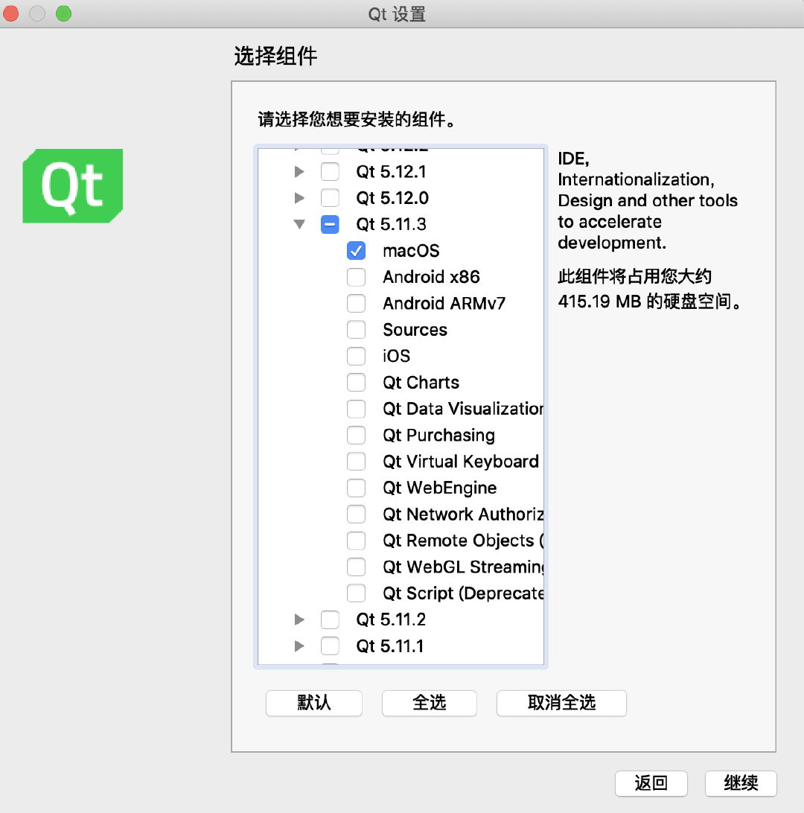

​	配置external tools

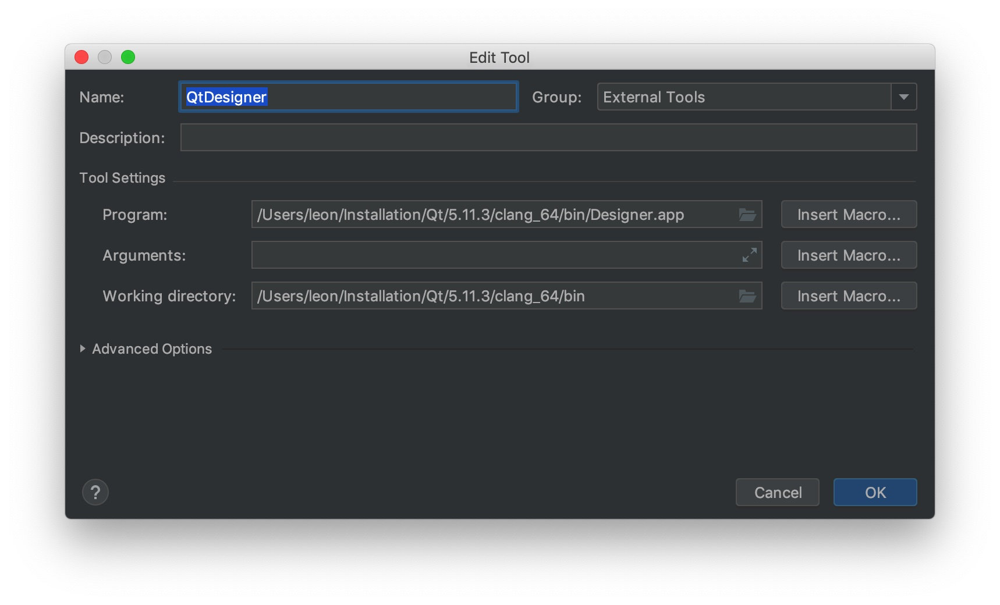

4. 文字转语音模块（可选）

```
pip install pyttsx3
pip install pyobjc
```

## *Definitions*

> SpeechRecognition: SpeechRecognition is a python-based speech recognition system designed by Anthony Zhang (Uberi). Speech Recognition system itself does not have speech recognition function. It mainly calls third-party speech recognition engine to realize speech recognition. 

> Sphinx: CMU Sphinx (Sphinx) is the general name of a series of speech recognition systems developed by Carnegie Mellon University in the United States.


# Run Steps

> 如何启动此程序及注意事项。

------

## 1. 注意

本项目的开发环境是 **macOS + python3.6**，为了保证程序正常运行，应该保证运行环境与开发环境一致。

因为程序中调用的是 mac 终端指令，所以在 **Windows** 操作系统中**无效**。

由于在 mac 的 python3.7 环境下无法安装 PocketSphinx (python package)，因此建议使用和开发环境一致的 python3.6。如果本机没有 python3.6 环境，可以使用 Anaconda 创建虚拟环境。

1. 创建 python3.6 虚拟环境

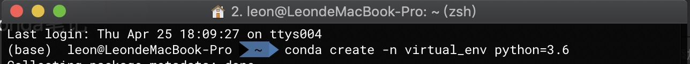

2. 查看 python 环境列表

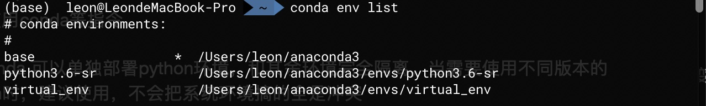

3. 切换到新的 python 环境


## 2. 运行

1. 使用 `pip`安装 python 包

    ```
    pip install SpeechRecognition
    pip install pocketsphinx
    // 安装 PyAudio 需要⽤用到 portaudio 库
    // 如果没有的话先安装 brew install portaudio pip install PyAudio
    pip install PyQt5==5.11.3
    ```

2. 在 Terminal 中跳转到 SpeechRecognition 文件夹，执行 `python ./asr.py`

    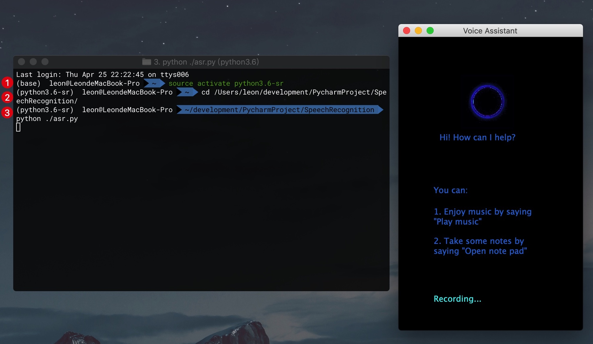

